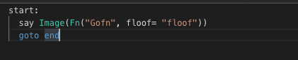

# Go lambda function boilerplate

## Install dependencies
Download the Lambda library for Go with go get, and compile your executable.
```
$ cd src
$ go get github.com/aws/aws-lambda-go/lambda
```
#### IMPORTANT NOTE
Make sure you compil the executable with `GOOS=linux go build main.go` even if you compile it in a non-Linux environment

## Compress function
Create a deployment package by packaging the executable in a ZIP file
```
$ zip function.zip main
```

#### IMPORTANT NOTE
For Go, the handler has to be called `main`


#### Use in CSML
